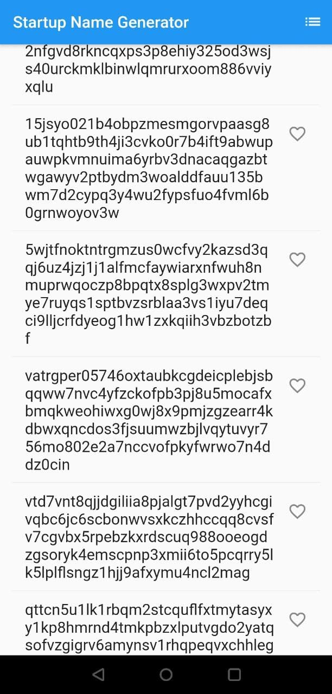

# Chart And List widget controller demo app for Flutter Android platform

Esta es una aplicación de demostración simple que instruye a los programadores sobre cómo usar los componentes básicos de Flutter. Incluye una vista de lista de cadenas con función de recopilación y también un gráfico de curvas con eje XY y número. Estas dos páginas se pueden cambiar libremente utilizando "Navigator".

## Getting Started

Este proyecto es un punto de partida para una aplicación Flutter. Aquí están las instrucciones.

- Install Flutter plugin in Android Studio.
- Create a new flutter project, choose SDK installtion path and click the installation button. Then complete the wizard by default value.
- Copy the content of the source code file 'lib/main.dart' into your project.
- Click upgrade the pub option menu under "Tools/Flutter".
- Click "Build/Flutter/Build APK".
- Install the app and have fun!

### ScreenShots

